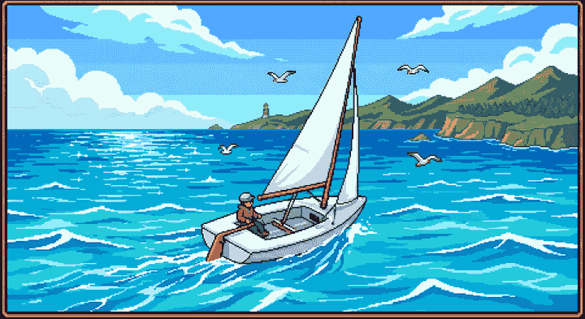

# Tiller

**The tiller is backwards, the wind is invisible, and somehow people make this look easy. Tiller teaches you how, one lesson at a time.**

You helm a little pixel-art dinghy and learn the things that quietly defeat every beginner: where the wind is, the no-go zone you can't sail into, the difference between tacking and gybing, and the one truth your hands have to learn the hard way (push the tiller *left* and the bow swings *right*). It runs in any browser, on your phone or your laptop. No wetsuit, no sailing club, no capsizing into cold water.



## Why you'd play it

- **It teaches real sailing, not arcade physics:** wind direction, points of sail, the no-go zone, tacking, gybing, and crew balance, all modelled from an actual sailing spec.
- **The backwards tiller, in your thumbs:** you steer with a real (inverted) tiller, so the muscle memory sticks in a way no diagram ever managed. That inversion is the whole lesson.
- **A 7-level voyage:** each level drills one new skill and switches the next hazard on only once you've earned it, Mario 1-1 style, until the full physics is live by the finale.
- **Built for a phone:** drag the tiller, slide the mainsheet into the green groove, swipe to cross sides, hold to hike out. Beat the par time for three stars.
- **A coach on your shoulder:** live tips while you sail, plus a How-to-sail card and a glossary for the moment "gybe" stops meaning anything.
- **Capsize is real:** lean the wrong way in the later levels and she goes over. Crew weight and hiking keep her flat.

Finish the voyage and you'll genuinely understand why a boat can't sail straight into the wind, and what to do about it.

## How it plays

You only ever touch two things: the **tiller** to steer and the **mainsheet** to trim the sail. Everything else is reading the wind.

| Action | On a phone | On a keyboard |
|--------|------------|---------------|
| Steer | Drag the tiller bar | `A` / `D` or `←` / `→` |
| Trim the sail | Drag the sheet into the green groove | `W` / `S` or `↑` / `↓` |
| Cross sides (through a tack or gybe) | Swipe across, or tap **CROSS** | `C` |
| Hike out (lean to stay flat) | Hold **HIKE** | `Shift` / `H` |
| Pause | Tap the pause button | `Esc` |

The catch with the tiller: aim the tiller, not the bow. Push it *away* from where you want to go.

## The voyage

Seven levels, each one new idea, each unlocking the next.

| # | Level | What it drills |
|---|-------|----------------|
| 1 | Cast Off | Steering, and the backwards tiller |
| 2 | Find the Groove | Trimming the sail to your angle to the wind |
| 3 | The No-Go Zone | Points of sail, and the wedge you can't sail into |
| 4 | Zig-Zag Upwind | Tacking: beating to a mark that's dead upwind |
| 5 | Downwind Run | Gybing without the boom slamming across |
| 6 | Crew & Balance | Crew weight, hiking, and roll tacks (capsize goes live) |
| 7 | The Full Course | The real windward/leeward race, with swimmers to rescue |

## Run it locally

It's a web app, so you just need Node and a browser.

```bash
npm install
npm run dev      # http://localhost:3000
```

Open it on your phone too: hit the dev server from your laptop's IP, or build and deploy it (this repo ships to Vercel).

```bash
npm run build    # production build
npm run check    # lint + format (oxlint + oxfmt via ultracite)
```

This is an npm-workspaces turborepo and the game lives in `apps/web`.

## Under the hood

Next.js 16, React 19, and a hand-rolled sailing engine rendered in 3D with Three.js. Type set in Geist Pixel.

```
apps/web/
  app/                Next.js App Router (mounts the game)
  components/game/    React shell, HUD, touch controls, wind rose, coach copy
  game/               Framework-agnostic sailing engine
    sailing.ts          pure sailing maths (wind angle, speed polar, trim, steering)
    constants.ts        tuned physics constants
    levels.ts           the 7-level campaign and its per-level training wheels
    three/              Three.js scene: world, boat, harbour, sim loop
    bridge.ts           React to engine pub/sub
docs/                 sailing-spec.md + sailing-params.json (the design source)
```

The whole sailing model (no-go half-angle, speed polar, trim efficiency, the tack/gybe state machine, scoring, and coaching copy) is specified in [`docs/sailing-spec.md`](docs/sailing-spec.md) and implemented faithfully in `game/`.

## License

A private project, built for the joy of it. Fair winds.

---

Crafted by [](https://matthewblode.com) [Matthew Blode](https://matthewblode.com)
