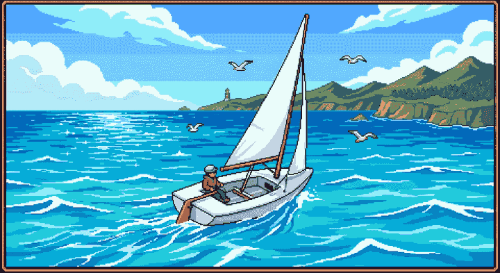

# [Tiller](https://blode.co/tiller)

**Learn to sail a dinghy in your browser: backwards tiller, invisible wind, no cold water**

Helm a pixel-art dinghy through seven lessons until you understand why a boat cannot sail straight into the wind.

## Demo

Runs in any browser, on a phone or a laptop. No wetsuit, no sailing club.

## Why you'd play it

- **It teaches real sailing, not arcade physics:** wind direction, points of sail, the no-go zone, tacking, gybing, and crew balance, all modelled from an actual sailing spec.
- **The backwards tiller, in your thumbs:** you steer with a real, inverted tiller, so the muscle memory sticks in a way no diagram ever managed. That inversion is the whole lesson.
- **A 7-level voyage:** each level drills one new skill and switches the next hazard on only once you've earned it, Mario 1-1 style, until the full physics is live by the finale.
- **Built for a phone:** drag the tiller, slide the mainsheet into the green groove, swipe to cross sides, hold to hike out. Beat the par time for three stars.
- **A coach on your shoulder:** live tips while you sail, plus a How-to-sail card and a glossary for the moment "gybe" stops meaning anything.
- **Capsize is real:** lean the wrong way in the later levels and she goes over. Crew weight and hiking keep her flat.

## How it plays

You only ever touch two things: the tiller to steer and the mainsheet to trim the sail. Everything else is reading the wind.

| Action | On a phone | On a keyboard |
|--------|------------|---------------|
| Steer | Drag the tiller bar | `A` / `D` or `←` / `→` |
| Trim the sail | Drag the sheet into the green groove | `W` / `S` or `↑` / `↓` |
| Cross sides, through a tack or gybe | Swipe across, or tap **CROSS** | `C` |
| Hike out, to lean and stay flat | Hold **HIKE** | `Shift` / `H` |
| Pause | Tap the pause button | `Esc` |

The catch with the tiller: aim the tiller, not the bow. Push it away from where you want to go.

## The voyage

Seven levels, each one new idea, each unlocking the next.

| # | Level | What it drills |
|---|-------|----------------|
| 1 | Cast Off | Steering, and the backwards tiller |
| 2 | Find the Groove | Trimming the sail to your angle to the wind |
| 3 | The No-Go Zone | Points of sail, and the wedge you can't sail into |
| 4 | Zig-Zag Upwind | Tacking: beating to a mark that's dead upwind |
| 5 | Downwind Run | Gybing without the boom slamming across |
| 6 | Crew & Balance | Crew weight, hiking, and roll tacks (capsize goes live) |
| 7 | The Full Course | The real windward and leeward race, with swimmers to rescue |

## License

A private project, built for the joy of it. Fair winds.

---

Crafted by  [Matthew Blode](https://blode.co)
